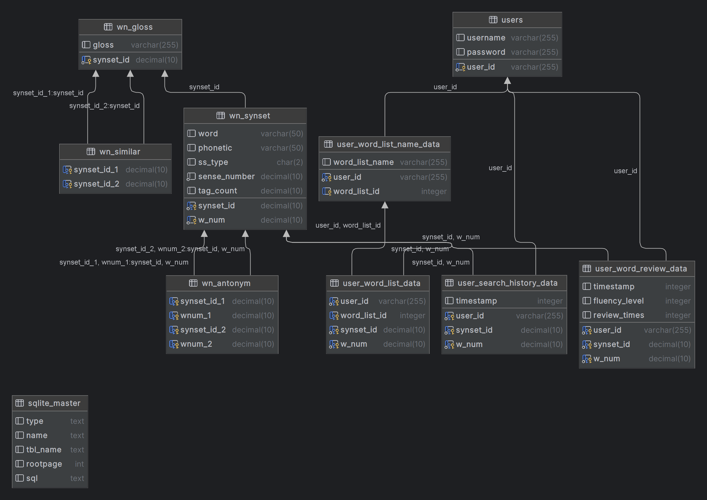
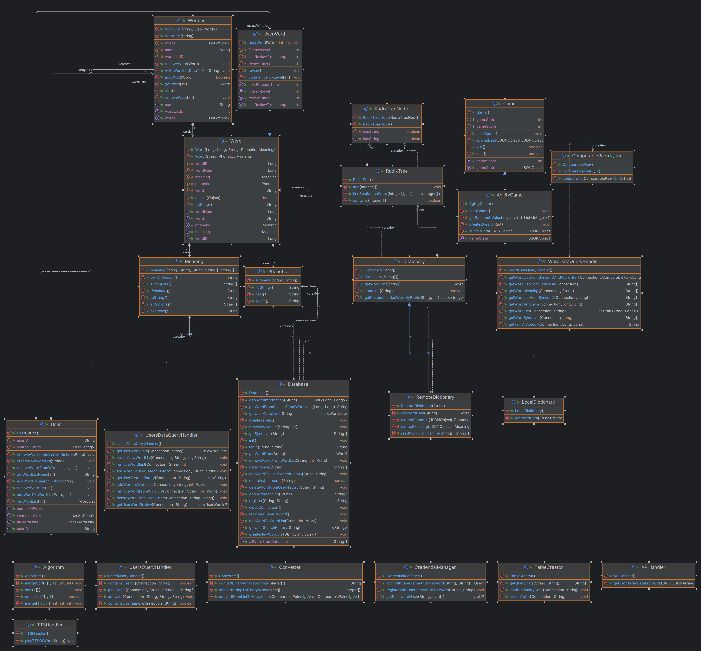
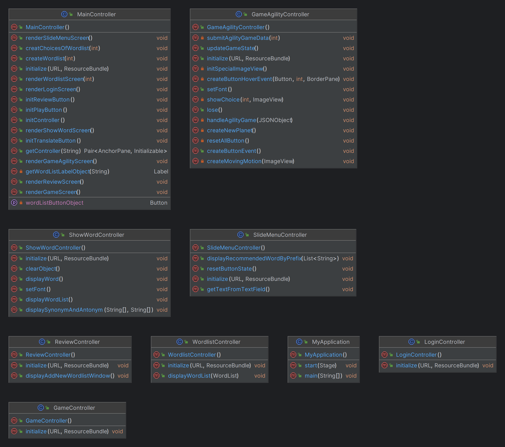

<h1 align="center">
  <p align="center">D1CTATORSZ</p>
  <!-- <a href="https://docusaurus.io"></a> -->
</h1>


# Introduction
D1ctatorsz is a **super pretty** and blazing fast application that support your learning English path. It's more than a dictionary with some extra features: creating wordlists and providing English games. Here's how we created it:

## Design: MVC (Model-View-Controller) Pattern
Our application leverages the MVC pattern in software design to divide the software into three separate components.

### Model
- Call API from
- We store database // satisfy all the Normal Form
- Algorithm: Radix Tree
- All the words are stored in database

This is the UML Diagram of the Database and the Application:



### View
This is the reference design of D1ctatorsz in Figma: 
<a href="https://www.figma.com/file/2o64Ur9zSjXQXakPDmkYx8/Dictionary?type=design&node-id=0%3A1&mode=design&t=g1viMZVVfMo8MH3J-1" target="_blank"></a>
Using anchor pane in javaFX, we were able o create the layout for the application. Everything else was built up on this layout.

### Controller
Each screen has its own controller, all managed by the main controller in `MyApplication.java`.

# Installation
```bash
git clone https://github.com/kannaaa3/d1cT1ONary.git 
```
Open and run project in the IDE.

### Usage
There are 3 main functions:
- A nice and blazing fast Dictionary, which allow searching for any words. Save word to any of your wordlist.
- Review section for reviewing and creating wordlists.
- Game Center with engaging games to enhance your English.
    In Agility Game, you need to choose the word that has the opposite meaning to the word shown on the screen. 

# Contributors
We are the `10`th group to present. Our members:

- Nguyen Thi Cat Tuong (22021207) [@JiXiang2108](https://github.com/JiXiang2108)
- Vu Minh Chau (22021105) [@RainbowBunny](https://github.com/RainbowBunny)
- Tran Thuy Dung (21020055) [@kannaaa3](https://github.com/kannaaa3)


# Future works
This app is designed to be able to extend many functionalities. Since we've got too many ideas but time doesn't allow us to!

- Learn mode for each wordlist (just like the trending flashcard style for learning a bunch of words). Moreover, each word has its level of memory - which express how good the user memorize it. Through time, we tend to forget what we've learn in the past, so this app will help you recall it after a 'designed' period.
- More games should be added in the Game Center!

# Credits
- UI inspired by [Web App UI Design](https://www.figma.com/community/file/1116248614926294639) and [Diamond Icons](https://www.figma.com/community/file/1079690264559560037).
- [JavaFX](https://openjfx.io/), a Java Framework for developing UI.

# Note
- Controller UML: 
- txt file can be used for remoteDictionary.
